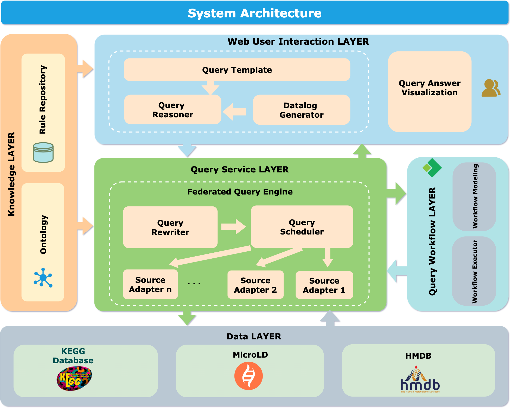

# Federated query engine

## System architecture

Layered architecture of the system consisting of five layers. The layers include a knowledge layer representing a unified domain model, a data layer involving distributed heterogeneous data sources,  a web user interaction layer providing a template-based user interface, a query service layer implementing the core federated query engine, and a query workflow layer orchestrating the execution of sub-queries.



## Install

1、clone the project to local.

```
git clone https://github.com/2714222609/fse.git
```

2、Execute the sql script int `./sqlexe` to import data to your local MySQL.

3、Change the database password in `application.yml` to your local database password.

4、Install Redis and background startup: [Install Redis](https://redis.io/)

5、Build the project.

```
mvn clean install
```

6、Find the main startup class `GMFDPApplication` and run.

